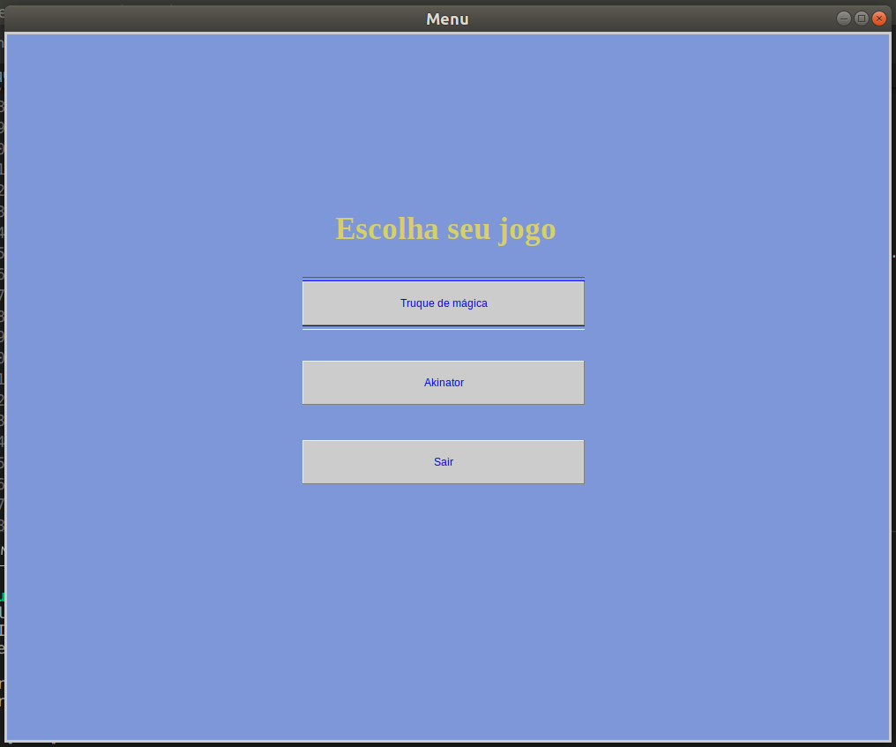
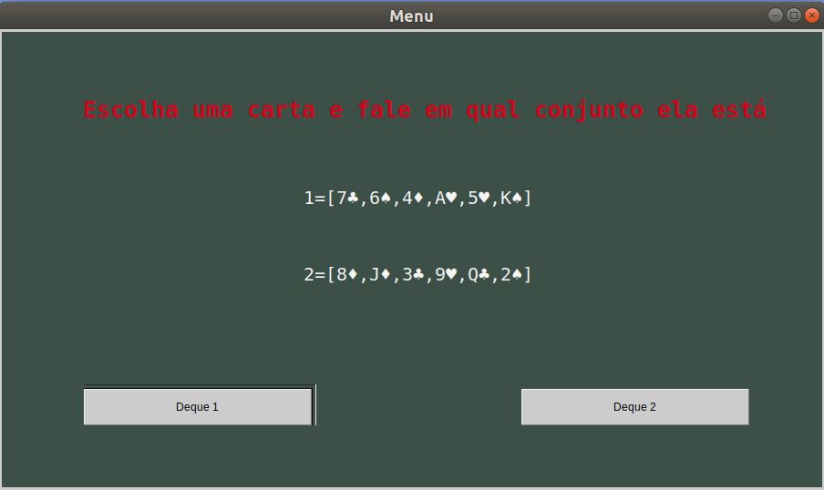
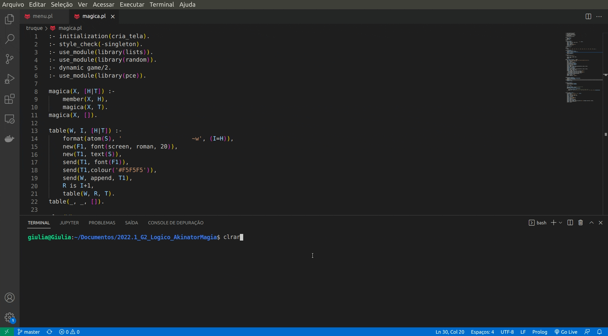

# 2022.1_G2_Logico_AkinatorMagia

# Akinator Magia

**Disciplina**: FGA0210 - PARADIGMAS DE PROGRAMAÇÃO - T01  
**Nro do Grupo**: 02 
**Paradigma**: Lógico 

## Alunos
| Matrícula | Aluno                                                               |
| --------- | ------------------------------------------------------------------- |
| 180119818 | [Felipe Boccardi Silva Agustini](http://github.com/fealps)          |
| 180052845 | [Gabriela da Gama Pivetta](http://github.com/gabrielapivetta)       |
| 180017659 | [Giovana Vitor Dionisio Santana](http://github.com/giovanadionisio) |
| 170011267 | [Giovanna Borges Bottino](http://github.com/giovannabbottino)       |
| 180017870 | [Giulia Lobo Barros](http://github.com/Giuulob89)                   |
| 170144488 | [Henrique Amorim Costa Melo](http://github.com/henriqueamorim20)    |
| 180018574 | [Hérya Rodrigues Alcantara](http://github.com/hryds)                |
| 180025601 | [Murilo Gomes de Souza](http://github.com/murilogds)                |

## Sobre 
O projeto Akinator/magia é um projeto com a finalidade de exercitar o conhecimento da equipe no paradigma logico, a aplicação criada fornece duas formas de se jogar a 1ª um jogo estilo akinator onde o programa vai tentar adivinhar um estado brasiliero em que o jogador está pensando. Na 2ª forma nós temos um "truque de magica" no qual o programa adivinha a carta escolhida pelo jogador.

## Screenshots

> Menu Principal

> Truque de Mágica

## Instalação

**Linguagens**: Prolog 
**Tecnologias**: SWI-Prolog 

- Para rodar o projeto a linguagem Prolog deve estar instalada
- Também é necessário ter a biblioteca xpce instalada
  > Pode ser que para Windows e Mac essa biblioteca não esteja disponível
- Clonar o projeto
- No terminal, entrar na pasta do projeto
- Utilizar o comando 'swipl' para rodar o prolog
- No prolog utilizar o comando '[menu].'

## Uso 

Para usar o projeto é simples! Depois que forem feitos os passos listados no tópico acima, a interface do menu principal já estará aparecendo e, a partir desse momento, é só escolher o jogo que deseja jogar, como mostra o gif abaixo:

> Truque de Mágica

## Vídeo

## Participações

| Aluno | Contribuição | Significância da Contribuição para o Projeto (Excelente/Boa/Regular/Ruim/Nula) |
| ----- | ------------ | ------------------------------------------------------------------------------ |
| Felipe | Desenvolvimento da regra de verificação de fim de jogo, game e auxilio no desenvolvimento do predicado magica no backend do truque de magica | Excelente |
| Gabriela | Finalização do jogo e Interface do Akinator                                                                                                | Excelente |
| Giovana | Criação dos fatos e predicados do jogo akinator (_backend_)                                                                                 | Excelente |
| Giovanna Bottino | Desenvolvimento da regra de verificação de fim de jogo, game e magica no backend do truque de magica                               | Excelente |
| Giulia | Desenvolvimento de verificação de entrada de usuário e interface do truque de magica                                                         | Excelente |
| Hérya | Criação dos fatos e predicados do jogo akinator (_backend_)                                                                                   | Excelente |
| Henrique | Finalização do jogo e Interface do Akinator                                                                                                | Excelente |
| Murilo | Desenvolvimento de verificação de entrada de usuário e interface do truque de magica                                                         | Excelente |

## Outros 
### I. Lições Aprendidas
A programação com Prolog trouxe o aprendizado do trabalho com uma linguagem não muito difundida, onde a documentação e dúvidas em fóruns são bem escassas quando comparada, por exemplo, à linguagem utilizada no paradigma anterior (Haskell). Algumas dúvidas que surgiram ao longo da elaboração do projeto não puderam ser sanadas, criando a necessidade de mudança de toda a forma de construção do projeto. Este foi o caso da utlização do predicado "retractall" utilizando uma comparação entre valores: por não conseguirmos utilizar o predicado desta forma, por isso foi necessária a utilização da base com as características descritas em termos de booleanos. 

### II. Percepções
Quanto a elaboração do jogo Akinator, foi percebido que a criação da base de dados demandou mais trabalho do que o planejado. Inicialmente, o jogo foi pensado para a adivinhação de países da América. Entretanto, ao iniciar a elaboração da base de dados, concluiu-se que não seria possível realizar adivinhação dos países, uma vez que estes possuem dados muito semelhantes, principlamente se tratando dos países da América Central. Por esse motivo, mudamos o tema para Estados do Brasil, onde foi possível criar [uma base onde todos os estados possuem dados únicos](https://giovanadionisio.notion.site/04952c57a24d48979a037b0ad6841bfb?v=6dfd01dc2c204e428d8bc859f5b506c3). 

Já no truque de magica, não foi necessario a criação de uma base de dados complexa, o desenvolvimento foi simples e o objetivo foi alcançado rapidamente. A programação lógica se mostrou muito eficiente para elaboração de deduções, comparada a outras linguagens elaborar esse mesmo truque iria requerer um grande numero de condicionais.

### III. Contribuições e Fragilidades

Quanto as fragilidades, ao jogar o akinator, as primeiras perguntas sempre estão relacionadas à região do estado, o que possibilita a decisão de quais perguntas serão feitas em seguida. No entanto, essa característica torna o jogo um pouco menos dinâmico. 

É facil de se adivinhar a maneira com que o programa "descobre" a carta escolhida, pois o truque de mágica real envolvido é simples. Além disso como é usado o predicado random_permutation/2 para embaralhar existe a possibilidade, embora ainda não tenha acontecido, que o programa nunca acerte a carta.

### IV. Trabalhos Futuros
No jogo akinator, as mesmas perguntas sempre são realizadas, independente da quantidade de fatos ainda restantes na base de dados. Uma verificação da base para a dedução de quais perguntas precisam ser realizadas com base nos fatos restantes é um possível trabalho futuro. 

Para melhorar o truque de mágica podemos adicionar as cartas como fatos e também dividir em mais de dois decks.

## Fontes

### Akinator
* Modelo de jogo: https://pt.akinator.com/
* Dados sobre os estados brasileiros: https://pt.wikipedia.org/wiki/Unidades_federativas_do_Brasil
  * Base final de dados elaborada pela equipe: https://giovanadionisio.notion.site/04952c57a24d48979a037b0ad6841bfb?v=6dfd01dc2c204e428d8bc859f5b506c3
* Documentação da Linguagem Prolog: https://www.swi-prolog.org/, para os predicados:
  * forall/2
  * findall/3
  * lenght/2
* Material de Aula da matéria de Paradigmas de Programação:
  * Com destaque para o predicado if-then-else.  
* Dúvidas gerais:
  * "Prolog how to count the number of facts without using a built in": https://stackoverflow.com/questions/59247778/prolog-how-to-count-the-number-of-facts-without-using-a-built-in
  * "how can I print all database facts in prolog": https://stackoverflow.com/questions/8510701/how-can-i-print-all-database-facts-in-prolog

### Magica
* Documentação da Linguagem Prolog: https://www.swi-prolog.org/
* Material de Aula da matéria de Paradigmas de Programação
* Sites para duvida em geral:
  * https://stackoverflow.com/questions/34997923/prolog-split-a-list-into-a-list-of-n-lists-containing-n-items-each
  * https://rodrigorgs.github.io/aulas/mata56/aula06-prolog-listas
  * https://www.complang.tuwien.ac.at/ulrich/iso-prolog/prologue#length
  * https://www.swi-prolog.org/pldoc/doc_for?object=random_permutation/2
